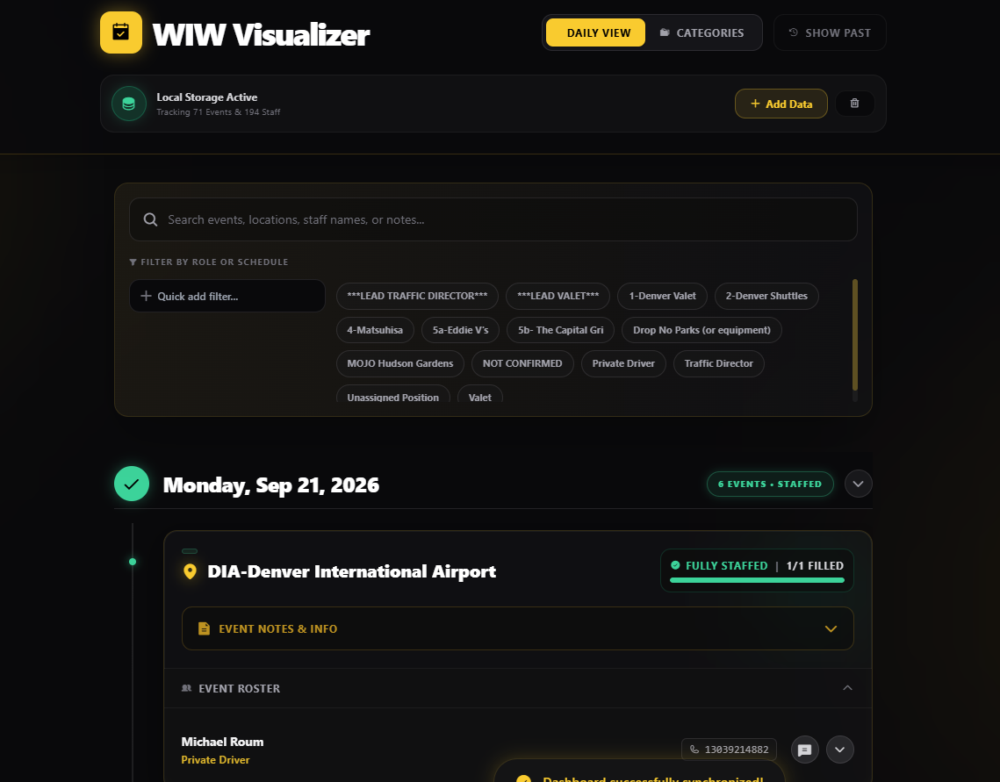

# WIW Visualizer

A single-file, browser-based dashboard that turns "When I Work" (WIW) Excel exports
into an interactive, mobile-friendly staffing schedule — searchable, filterable, and
grouped by day or by account. Everything runs client-side in your browser; no data is
ever uploaded anywhere.

**Live tool:** https://jaysvaletss.github.io/wiw-list/

> **New here?** The tool has a built-in **How to Use** walkthrough with screenshots —
> it opens automatically the first time you visit, and you can reopen it anytime via
> the **How to Use** button in the header.

## Quick start

1. **Export two files from When I Work:**
   - **Schedule export** — the shift/schedule spreadsheet (its sheet tabs are named
     `Schedules - <name>`, e.g. `Schedules - Valet`).
   - **Users export** — the staff roster (`First Name`, `Last Name`, `Phone Number`,
     `Email`, `Positions`).
2. Open the [live tool](https://jaysvaletss.github.io/wiw-list/) in your browser.
3. Drag and drop each file into its matching drop zone (Schedule vs. Users) — or click
   a zone to browse for the file. The app makes a best guess from the filename and
   warns you if a file looks like it's in the wrong slot.
4. Click **Synchronize Data**. The app cross-references every scheduled shift against
   the staff roster (so each shift shows the right phone number and email) and builds
   the dashboard.
5. That's it — your data is saved to your browser's local storage, so it's still there
   next time you open the page. No login, no server, no re-uploading.

## Using the dashboard

Once data is loaded you'll see the header shown above:

- **Daily View / Categories** toggle — switch how events are grouped (see below).
- **Light Mode / Dark Mode** button — switch the whole app's theme. Your choice is
  remembered for next time.
- **Show Past** — Daily View hides past days by default; toggle this to bring them back.
- **Search bar** — filters events by site name, staff name, position, or event notes as
  you type.
- **Filter pills** — click a pill (e.g. `Valet`, `Traffic Director`, `4-Matsuhisa`) to
  narrow the view to just that role or schedule. Click it again to remove it. Use
  **Quick add filter** to jump straight to a specific pill by typing part of its name.
- **Local Storage Active bar** — shows how many events and staff are currently tracked.
  - **Add Data** re-opens the upload zones so you can sync a newer export. Uploading a
    new Schedule file replaces only the dates included in that file — everything else
    stays put. Uploading just a Users file re-attaches updated phone/email info to your
    existing schedule without touching the shifts themselves.
  - **Wipe Database** (trash icon) clears everything from local storage, with a
    confirmation step, if you want to start fresh.

### Daily View vs. Categories View

- **Daily View** (default) groups every event under its date, most recent first, with a
  green "Staffed" badge on any day where nothing is left open. Click a date header to
  collapse/expand that day.
- **Categories View** splits events into **Main Parties** and **Corporate Accounts**
  (accounts like Matsuhisa, Eddie V's, Capital Grille, MOJO/Hudson Gardens are detected
  automatically by name and grouped separately).

### Reading an event card

Each card (like the `DIA-Denver International Airport` example above) shows:

- The site name and a **Fully Staffed** / **X Openings** badge with a fill progress bar.
- **Event Notes & Info** — click to expand any notes attached to that event.
- **Event Roster** — every assigned staff member, plus a placeholder row for each open
  (unfilled) shift, marked in red.

### Working with a staff member's row

Click anywhere on a staff row to expand their profile (shift time, phone, email, system
roles). From a collapsed row you can also:

- **Message icon** — opens Google Voice in a new tab with that staff member's number
  pre-filled, ready to text.
- **Down-caret** — expands/collapses their profile details.

Inside the expanded profile:

- **Copy All** — copies the staff member's name, phone, role, and email to your
  clipboard in one click.
- **Private Shift Notes** — a text box for jotting private notes about that specific
  person's specific shift. These save automatically to your browser and persist across
  visits (a small notebook icon appears next to their name once a note exists). Notes
  are stored per-browser only — they aren't shared with anyone else viewing the tool.

## Notes on data & privacy

The tool never sends your files anywhere — parsing happens entirely in your browser via
SheetJS, and the resulting dashboard is cached in your browser's local storage. Clearing
your browser data (or using a different browser/device) means the dashboard won't be
there until you re-sync the export files.

## For developers

See [`CLAUDE.md`](CLAUDE.md) for the app's architecture, data pipeline, and coding
conventions if you're making changes to `index.html`.
